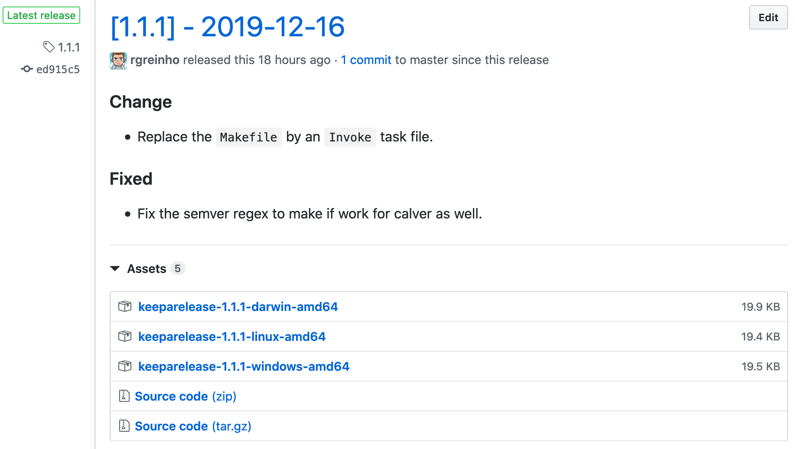

# Keeparelease

Publish beautiful GitHub releases with "keep a changelog".

## Features

This tool was made to simplify creating beatiful releases on GitHub for projects following the
"[Keep A Changelog](https://keepachangelog.com/en/1.0.0/)" specification to write their Changelogs.

It aims to make it easy and convenient to publish the relevant Changelog section as the release description and
to attach the related assets.

Here is an example:



## Installation

### Using the installer (recommended)

The installer uses [Fetch](https://github.com/gruntwork-io/fetch), a tool to simplify
downloading assets from a GitHub release. You must install it first in order to be able
to run the installer:

```bash
./extras/fetch-installer.sh
```

Verify the installation by running `fetch --version`.

Once you [Fetch](https://github.com/gruntwork-io/fetch) is installed, you can install
`keeparelease`, either by running the installer from this repository:

```bash
./extras/keeparelease-installer.sh
```

Or by running the it directly from GitHub:

```bash
bash <(curl -sSfL https://raw.githubusercontent.com/rgreinho/keeparelease/master/extras/keeparelease-installer.sh)
```

Verify the installation by running `keeparelease --version`.

By default it downloads the latest version available. If you want to download a specific
version, set the `$VERSION` environment variable:

```bash
VERSION=1.2.0 ./extras/keeparelease-installer.sh
```

### Using curl

Thfollowing commands will help you download the latest binary available to your platform:

```bash
REPO=rgreinho/keeparelease
VERSION=$(git ls-remote --tags --refs --sort="v:refname" git://github.com/${REPO}.git | tail -n1 | sed 's/.*\///')
PLATFORM=$(uname -s | tr '[:upper:]' '[:lower:]')
curl -LO https://github.com/${REPO}/releases/download/${VERSION}/keeparelease-${VERSION}-${PLATFORM}-amd64
```

After that, you should add the executable permissions (usually using `chmod +x`),
and move the binary to the location of your choice (usually in your path, for instance
`/usr/local/bin`).

### Manual

Simply download the binary for your platform from [the release page](https://github.com/rgreinho/keeparelease/releases).

Same as above, set the appropriate permission, and move the binary to the location of
your choice.

## Usage

Creating a release and attaching all binaries:

```bash
keeparelease \
  -a keeparelease-1.1.1-darwin-amd64 \
  -a keeparelease-1.1.1-linux-amd64 \
  -a keeparelease-1.1.1-windows-amd64
```

Print the changelog for the latest release:

```bash
keeparelease -x
```

Set the log level on the CLI:

```bash
keeparelease -l debug
```

Set the log level with environment variables:

```bash
export KAR_LOG_LEVEL=DEBUG
keearelease
```
